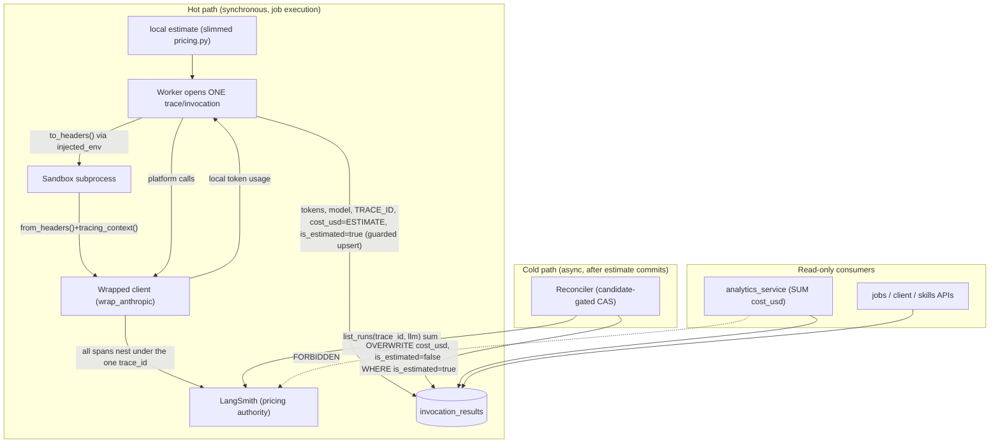

# Architecture Spine — LLM Cost Tracking (LangSmith Source of Truth)

## Design Paradigm

**Estimate-then-reconcile over a single external pricing authority.**

The hot path (a job execution) writes an **instant local estimate** of cost so
the Run Console shows a number immediately — then an asynchronous reconciler
**overwrites** it with LangSmith's authoritative figure. The local estimate is
provisional-by-construction; LangSmith is always the final word. This buys
instant UX without making a home-grown rate table the source of truth.

Three roles, strict precedence:

- **LangSmith** = pricing **authority** + tracing backend. Receives every LLM
  call (`langsmith.wrappers.wrap_anthropic`), computes per-call/per-model cost
  natively. Its `total_cost` is the authoritative value that overwrites the
  estimate. LangSmith does **not** expose its rate map to us (verified), so the
  estimate cannot reuse LangSmith's rates.
- **Slimmed local rate table** (`app/core/pricing.py`, retained) = provides the
  **provisional estimate only**, at completion time. Never final; always subject
  to reconciliation. Not a competing source — a placeholder.
- **Postgres `invocation_results`** = billing/analytics **system of record**.
  Persists whichever value is current (estimated → then reconciled), with a
  `cost_is_estimated` flag, so SQL aggregates and offline/client reads work
  without calling LangSmith.

Namespace mapping (brownfield, ratified):

| Concern | Home |
| --- | --- |
| Wrapped-client factory (the one tracing seam) | `app/core/tracing.py` (rewritten) + sandbox `velara_trace.py` |
| Cost reconciliation task | `app/workers/` (new reconciler task) |
| Cost persistence | `app/models/invocation.py` (`InvocationResult`) |
| Cost consumption (read-only) | `app/services/analytics_service.py`, `app/api/v1/{jobs,client,skills}.py` |

## Invariants & Rules

### AD-1 — LangSmith is the authoritative pricing source; the local table is a provisional estimate only [ADOPTED]

- **Binds:** all LLM cost computation, platform and sandbox
- **Prevents:** a home-grown price becoming the permanent, uncorrected truth (drift from the observability dashboard)
- **Rule:** LangSmith's `total_cost` is the **final, authoritative** cost. `app/core/pricing.py` is **retained but demoted** to producing a provisional *estimate* (`compute_cost_usd`), used only until reconciliation overwrites it. Strict precedence: an estimate is always provisional and MUST be reconcilable; a reconciled value is never re-estimated. LangSmith does not expose its rate map (verified), so the estimate uses our own slimmed table — kept minimal and understood to be approximate. (Non-LLM `code`-runtime rows keep explicit `cost_usd = 0` — a "nothing to price" constant, `cost_is_estimated = false`, never routed through either path.)

### AD-2 — Every Anthropic client passes through `wrap_anthropic`; no hand-rolled tracing

- **Binds:** every Anthropic API access (platform `anthropic_client.py`; sandbox skills)
- **Prevents:** divergent tracing implementations and the per-call/streaming/multi-model capture bugs of a bespoke wrapper
- **Rule:** The invariant is the **wrap mechanism**, not a single factory: no Anthropic client reaches a call site un-wrapped. All clients are obtained through `langsmith.wrappers.wrap_anthropic(anthropic.Anthropic(...))`. No custom `RunTree`, no `_emit_span`, no `_TracedClient`/`_TracedStream`/`_TracedMessages`. The two shipped provider factories (`get_llm_provider`, `get_adapter_llm_provider` — different *models*, Story 17.2) both stand and both return wrapped clients. The sandbox shim installs `wrap_anthropic` via monkeypatch of `anthropic.Anthropic` so a skill's own internally-built client is traced with zero skill cooperation. `wrap_anthropic` handles `.create` / `.stream` / `beta.create` natively (verified) — the reason no bespoke stream/multi-model capture is permitted.

### AD-3 — The hot path writes an instant estimate, never blocks on LangSmith

- **Binds:** `run_code_driven_hybrid`, `execution_tasks` completion write, platform LLM call sites
- **Prevents:** blocking job completion on LangSmith's async cost; a blank/"pending" cost on the Run Console
- **Rule:** At completion the worker persists `input_tokens`, `output_tokens`, `model`, `langsmith_run_id`, and a **provisional** `cost_usd` from the local estimate with `cost_is_estimated = true`. It must not wait for or read LangSmith cost inline. If the model is unknown to the local table, `cost_usd = NULL` (still reconcilable later).

### AD-4 — Reconciler overwrites the estimate with LangSmith's authoritative cost

- **Binds:** the new reconciler task; `InvocationResult.cost_usd` / `cost_is_estimated`
- **Prevents:** the provisional estimate becoming permanent; partial/racy cost writes
- **Rule:** A single asynchronous reconciler reads LangSmith's `total_cost` for the invocation's trace, **overwrites** `cost_usd`, and sets `cost_is_estimated = false`. It sums `total_cost` across **all** llm runs under the trace (N calls across M models). Idempotent, bounded-retry (cost may not be computed yet), and it never regresses a reconciled (`false`) row back to an estimate or to NULL.

### AD-5 — Cost states: estimated (provisional) · reconciled (authoritative) · NULL (unpriceable); never fabricated $0

- **Binds:** all cost consumers (`analytics_service`, jobs/client APIs, certification)
- **Prevents:** treating an estimate as final, or a pending/untraceable run as free
- **Rule:** `cost_is_estimated = true` → provisional (real dollars, subject to change); `false` with non-NULL `cost_usd` → authoritative; `cost_usd IS NULL` → genuinely unpriceable (unknown model / no trace), treated as "unknown", never coalesced to 0 for an LLM runtime. `SUM(cost_usd)` skips NULLs and may sum estimated+reconciled (both are real figures); a dashboard MAY surface "includes N estimated". Explicit `0` stays reserved for genuine no-LLM `code` runs.

### AD-6 — Tracing-off keeps the estimate; nothing to reconcile

- **Binds:** test env, air-gapped/offline deploys (`LANGSMITH_TRACING` off/unset)
- **Prevents:** silent breakage of the currently-working tracing-off path; a hard dependency on the SaaS to price a run
- **Rule:** With tracing disabled, tokens + the local **estimate** are still written (`cost_is_estimated = true`), and no `langsmith_run_id` is set (`get_current_run_tree()` is None when tracing off — verified). The reconciler no-ops for any row without a `langsmith_run_id`, leaving the estimate untouched (never regressed to NULL). Job execution succeeds regardless of LangSmith availability.

### AD-7 — One invocation-scoped trace; sandbox inherits it by header propagation

- **Binds:** `tracing.py` emitter, `code_driven_executor` + `velara_trace` shim, `execution_tasks`
- **Prevents:** the single-scalar `run_id` addressing only one of an invocation's N calls (multi-model undercount), and the sandbox subprocess emitting a *separate, unreconcilable* trace
- **Rule:** The worker opens **exactly one** LangSmith trace per leaf invocation *before* the first LLM call; every span — all platform tool-turns AND all in-sandbox skill calls — nests under it. The emitter must **stop minting independent root runs**. Cross-process: the worker passes `parent.to_headers()` into the sandbox via `injected_env`; the shim rebuilds context with `RunTree.from_headers()` + `tracing_context()` (verified to share `trace_id` across the subprocess boundary). The persisted linkage is the **`trace_id`** (`langsmith_run_id` column holds it), never a per-span run id. The reconciler resolves cost via `list_runs(trace_id=…, run_type="llm", select=["total_cost"])`.

### AD-8 — Never-regress is symmetric; reconcile is candidate-gated compare-and-set

- **Binds:** both cost writers — worker completion write (AD-3) and reconciler (AD-4)
- **Prevents:** a fast reconcile being clobbered back to an estimate; a redelivered reconciler double-writing; reconciling a partially-computed cost
- **Rule:** The estimate write is a **guarded upsert**: it sets `cost_is_estimated = true` only when the row is absent or already estimated — it must never overwrite a reconciled (`false`) row. The reconciler writes with a **compare-and-set** (`UPDATE … WHERE cost_is_estimated = true`), so a redelivered run is a no-op. It reconciles **only** when LangSmith reports the trace's cost as complete (all child llm runs present and `total_cost` non-NULL on each) — never on the first partial read. Reconciliation is enqueued only *after* the estimate row commits (from the completion transaction / outbox), never on a bare timer that could beat it.

### AD-9 — Reconcile leaf LLM rows only; fan-out parents and code runs are $0-terminal

- **Binds:** reconciler candidate predicate; `analytics_service` leaf sum
- **Prevents:** overwriting a fan-out parent's deliberate `$0` with the rolled-up child cost (double-count in `SUM(cost_usd)`)
- **Rule:** Reconciliation candidates are **leaf** invocation rows whose runtime made a platform LLM call and that carry a `langsmith_run_id`. `fan_out = true` parent rows keep `cost_usd = 0`, `cost_is_estimated = false`, are never assigned a trace, and are never reconciled — preserving the existing analytics invariant (leaf-sum works *because* the parent is 0). Genuine `code` runs are likewise `0`-terminal. Each child reconciles only the runs under **its own** trace.

### Dependency direction

## Consistency Conventions

| Concern | Convention |
| --- | --- |
| Authoritative cost | LangSmith `total_cost` (final); local table produces the provisional estimate only |
| `cost_is_estimated` | `true` = provisional (may change); `false` = reconciled/authoritative |
| `cost_usd` NULL | genuinely unpriceable (unknown model / no trace) — never coalesced to 0 for LLM runtimes |
| Client acquisition | Always `wrap_anthropic(...)`; direct `anthropic.Anthropic()` only inside the wrap factory / monkeypatch |
| Trace linkage | `langsmith_run_id` (trace id) persisted on `InvocationResult` at completion |
| Reconciler | Idempotent, bounded-retry, never regresses `false`→estimate/NULL; never the hot path |
| Consumer → LangSmith | Forbidden; consumers read only Postgres `cost_usd` / `cost_is_estimated` |

## Stack

| Name | Version |
| --- | --- |
| langsmith | 0.10.10 (already pinned; `wrappers.wrap_anthropic`, `Client.read_run`/`list_runs`, `Run.total_cost`) |
| anthropic | >=0.69 (existing) |
| Postgres `invocation_results.cost_usd` | `Numeric(12,6)`, migration 0024 (kept; source of value changes) |

## Structural Seed

New/changed shape (owned by the code once built):

- `InvocationResult` gains `langsmith_run_id: str | None` (trace id) and `cost_is_estimated: bool` (default true when a cost is written by the estimate path). Migration required.
- New reconciler Celery task (self-scheduled ~60s after completion, bounded retries) — `[ASSUMPTION]` vs a periodic sweep of `cost_is_estimated = true` rows.
- `app/core/pricing.py` **retained but slimmed** to the estimate role; `compute_cost_usd` output is always provisional. Callers (`tracing.py`, `skills.py`, `execution_tasks.py`, `code_driven_executor.py`) write estimate + `is_estimated` at completion.
- Sandbox `velara_trace.py` collapses to: monkeypatch `anthropic.Anthropic` → `wrap_anthropic(real())`, plus a local token accumulator for the DB write. All custom span/stream/cost code deleted.

## Deferred

- **Per-model token columns.** DB keeps single `input_tokens`/`output_tokens`/`model` (lossy for multi-model runs); LangSmith holds per-model truth. Cost is authoritative (summed from LangSmith); DB token display is approximate. Revisit only if per-model token breakdown becomes a product requirement.
- **Reconciler trigger mechanism** (self-scheduled task vs periodic sweep of `is_estimated=true`) — `[ASSUMPTION]` self-scheduled; confirm at build.
- **Backfill of historical rows** priced by the old `pricing.py` — out of scope; existing values stand (treated as reconciled).
- **Estimate rate-table maintenance** — the slimmed local table drifts from real prices over time; it only affects the provisional window (reconciliation corrects it), so staleness is low-stakes. Revisit cadence deferred.
- **LangSmith outage policy** beyond bounded retry (estimate simply stands permanently; optional alert after N reconcile failures) — operational, defer to build.
- **Certification evidence (17.3)** cost assertions — an estimated value is present immediately (no blank window), but may change on reconciliation; if 17.3 snapshots cost into evidence, decide whether it captures estimate or waits for reconciled. Flag for the 17.3 owner.
